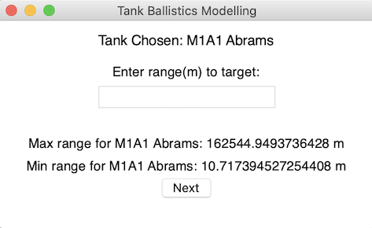

## Tank Ballistics Modelling

Models the projectile motion of various tanks firing shells. Shell trajectory is modelled using Matplotlib

This project currently uses very simple physics, projectile motion calculations are done without the consideration of air resistance. 
So a lot of the resulting values are very inflated and unrealistic, for example the calculated max range of the M1A1 Abrams with the 120mm M256 smooth-bore gun is calculated to be 160+ km.
In reality according to [this](https://www.quora.com/What-is-the-maximum-range-of-an-Abrams-tank-firing-a-shell) source, the max range is around 20 km. So I am currently working on adding the capability to model the projectile motion with air resistance

TODO/Potential Extensions: 
- Model projectile motion in a much more realistic manner, incorporate air resistance and drag and compare that to firing in a vacuum 
- Model different ammunition types, eg HE vs APFSDS
- Model more tanks, and different guns, eg. smooth-bore vs rifled guns
- Model the energy at impact of various shell types 

## Screenshots
Main Page           |  Range Entry Window
:-------------------------:|:-------------------------:
   |  

 Trajectory Stats          |  Trajectory Plot
:-------------------------:|:-------------------------:
   |     

 
## Installation
To install and run, clone the repository, navigate to the cloned repository and run the following commands:
  ```bash
    pip install -r requirements.txt 
   ```
  ```bash
    python main_app.py
   ```

## Usage
1. From drop-down menu select the tank you wish to model
2. Enter the range to the target and ensure the entered range is between min and max range displayed
3. A window will pop up and display some stats about the trajectory. Select "View shell trajectory"
4. An interactive plot of the shell's trajectory will pop up

## References and Acknowledgment
[1] [Physics with Python](http://firsttimeprogrammer.blogspot.com/2014/07/physics-with-python.html) <br>
[2] [Physics Projectile Motion](https://www.youtube.com/watch?v=bqYtNrhdDAY) <br>
[3] [Physics Projectile Motion: Find Angle](https://math.stackexchange.com/questions/1378973/physics-projectile-motion-finding-the-angle) <br>
[4] [Matplotlib](https://matplotlib.org/3.3.3/api/_as_gen/matplotlib.pyplot.html) <br>
[5] [Python Projectile Motion](https://stackoverflow.com/questions/34232664/projectile-motion-simple-simulation-using-numpy-matplotlib-python) <br>
[6] [Python GUI Programming With Tkinter](https://realpython.com/python-gui-tkinter/) <br>
[7] [Abrams Max Range](https://www.quora.com/What-is-the-maximum-range-of-an-Abrams-tank-firing-a-shell) <br>

Sources for the various tank specifications are listed in "tank_info.py"
